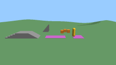
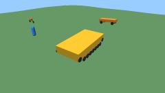
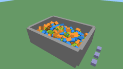
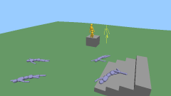
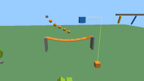
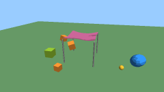
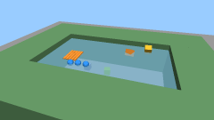
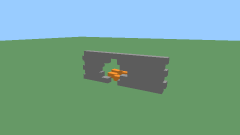
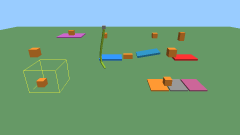
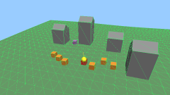

<p align="center">
  <picture>
    <source media="(prefers-color-scheme: dark)" srcset="docs/assets/oxijolt-logo-dark.png">
    
  </picture>
</p>

# oxijolt — Rust bindings for Jolt Physics
[](https://crates.io/crates/oxijolt)
[](https://docs.rs/oxijolt)
[](https://github.com/pockerhead/oxijolt/actions/workflows/ci.yml)
[](#license)
[](https://github.com/jrouwe/JoltPhysics/releases/tag/v5.6.0)

Rust bindings for [Jolt Physics](https://github.com/jrouwe/JoltPhysics) 5.6: a safe API with
rigid bodies, a character controller, wheeled and tracked vehicles and motorcycles, ragdolls, soft
bodies, constraints and contact events, built for deterministic simulation. Underneath are raw
bindings to the [joltc] C wrapper. Everything runs headless and is tested without a window.

## Playground

Ten small scenes in a window show what the binding does: a character, vehicles, a pile of bodies,
ragdolls, constraints, soft bodies, buoyancy, destruction, contact control and queries. Click a
picture for its clip.

<table>
  <tr>
    <td align="center"><a href="docs/media/character.gif"></a><br>1 Character on terrain</td>
    <td align="center"><a href="docs/media/vehicles.gif"></a><br>2 Car, tank and motorcycle</td>
    <td align="center"><a href="docs/media/pile.gif"></a><br>3 Body pile and impacts</td>
    <td align="center"><a href="docs/media/ragdolls.gif"></a><br>4 Ragdolls and a mapped puppet</td>
    <td align="center"><a href="docs/media/constraints.gif"></a><br>5 Constraints and motors</td>
  </tr>
  <tr>
    <td align="center"><a href="docs/media/soft-bodies.gif"></a><br>6 Cloth, balloon and soft cube</td>
    <td align="center"><a href="docs/media/water.gif"></a><br>7 Buoyancy and water</td>
    <td align="center"><a href="docs/media/destruction.gif"></a><br>8 Breakable wall</td>
    <td align="center"><a href="docs/media/contacts.gif"></a><br>9 Contact control and sensors</td>
    <td align="center"><a href="docs/media/queries.gif"></a><br>0 Queries, state and origin</td>
  </tr>
</table>

In a clone of the repository:

```sh
git clone --recursive https://github.com/pockerhead/oxijolt
cd oxijolt
cargo run -p playground --release
```

It needs Rust (stable), CMake 3.20 or newer and a C++ toolchain: MSVC on Windows, where the window
needs nothing else. On Linux, install `pkg-config libx11-dev libxi-dev libgl1-mesa-dev` first; CI
builds the window on Windows only. The first build compiles Jolt and takes several minutes.

To skip compiling Jolt on Windows, download
`oxijolt-sys-<version>-x86_64-pc-windows-msvc-debug-renderer.tar.gz` from the
[releases](https://github.com/pockerhead/oxijolt/releases), unpack it, and point `JOLTC_LIB_DIR` at
the unpacked directory in the shell that builds the playground (other builds refuse a prefix with
the debug renderer; it needs MSVC 19.44 or newer, see
[building](docs/building.md#release-archives)):

```powershell
$env:JOLTC_LIB_DIR = "C:\path\to\oxijolt-sys-<version>-x86_64-pc-windows-msvc-debug-renderer"
cargo run -p playground --release
```

Keys in every scene: 1 to 9 and 0 choose a scene, R resets it, P pauses, N runs one tick while
paused, G shows the collider wireframe, H hides the help, right drag and the wheel move the camera,
Esc quits. Each scene adds its own:

**1 Character on terrain** (`character`)

| Keys | Action |
|---|---|
| W A S D | walk, relative to the camera |
| Shift | sprint |
| Space | jump |

**2 Car, tank and motorcycle** (`vehicles`)

| Keys | Action |
|---|---|
| Tab | switch: walker, car, tank, motorcycle |
| W S | throttle; against the motion it brakes first |
| A D | steer; the tank turns on the spot when standing |
| Space | hand brake, or jump when walking |

**3 Body pile and impacts** (`pile`)

| Keys | Action |
|---|---|
| Space | drop another layer |
| F | fire a heavy ball at the cursor |

**4 Ragdolls and a mapped puppet** (`ragdolls`)

| Keys | Action |
|---|---|
| Space | drop another ragdoll |
| M | puppet: motors and falling, or back to kinematic |

**5 Constraints and motors** (`constraints`)

| Keys | Action |
|---|---|
| Up, Down | windmill motor faster or slower |
| E | elevator up or down |

**6 Cloth, balloon and soft cube** (`soft-bodies`)

| Keys | Action |
|---|---|
| E | release the cloth's pins |
| F | throw a ball at the cursor |

**7 Buoyancy and water** (`water`)

| Keys | Action |
|---|---|
| C | current on or off |
| Space | drop another crate |

**8 Breakable wall** (`destruction`)

| Keys | Action |
|---|---|
| F | fire a cannonball at the cursor |
| left click | knock out the brick under the cursor |

**9 Contact control and sensors** (`contacts`)

| Keys | Action |
|---|---|
| Space | drop a box over every station |
| E | swing the chain |

**0 Queries, state and origin** (`queries`)

| Keys | Action |
|---|---|
| mouse | ray, sphere cast, overlap and point test under the cursor |
| left click | push the body under the cursor |
| T | the last clicked crate: kinematic or dynamic |
| K, L | save the world, restore it |
| B | move the origin to the point under the cursor |

The clips are made by the playground itself and can be regenerated after any change with
`cargo run -p playground --release -- --record all`. [docs/playground.md](docs/playground.md) has
what each scene uses, the headless mode and how recording works.

## Example

```rust
use oxijolt::prelude::math::*;
use oxijolt::prelude::*;

fn main() -> oxijolt::error::Result<()> {
    let mut world = PhysicsWorld::new(WorldSettings::default())?;

    // A static floor whose top is at y = 0, and a ball dropped onto it.
    let floor = Shape::new_box(Vec3::new(50.0, 1.0, 50.0))?;
    world.create_body(&floor, &BodySettings::new_static().position(RVec3::new(0.0, -1.0, 0.0)))?;
    let ball_shape = Shape::new_sphere(0.5)?;
    let ball = world.create_body(
        &ball_shape,
        &BodySettings::new_dynamic().position(RVec3::new(0.0, 4.0, 0.0)),
    )?;

    for _ in 0..120 {
        // A step that had to drop contacts says so; raise a `WorldSettings` limit then.
        let report = world.step(1.0 / 60.0)?;
        assert!(report.is_complete(), "{report:?}");
    }
    println!("the ball rests at {:?}", world.body(ball)?.position());

    // A ray cast down from above hits the ball first.
    let ray = RayCast::new(RVec3::new(0.0, 10.0, 0.0), Vec3::new(0.0, -20.0, 0.0));
    let hit = world.cast_ray(ray, &QueryFilter::new())?.expect("the ray hits");
    assert_eq!(hit.body, ball);
    Ok(())
}
```

With Bevy, `use oxijolt::prelude::*` next to `bevy::prelude::*`; see `oxijolt::prelude`.

```toml
[dependencies]
oxijolt = "0.6"
```

## Roadmap

The full list of what works today, with links to the guides, is in
[docs/features.md](docs/features.md).

- [x] Rigid bodies: box, sphere, cylinder, capsule, heightfield and compound shapes, materials
- [x] Scene queries: ray casts, shape casts, collide-shape, with filters
- [x] Character controller (`CharacterVirtual`)
- [x] Wheeled vehicles
- [x] Ragdolls
- [x] Twelve kinds of constraints with motors, springs and limits
- [x] Soft bodies
- [x] Contact, activation and soft body contact events; contact listener
- [x] Saving and restoring world state
- [x] Floating origin and optional `f64` positions
- [x] Jolt's jobs on your own thread pool
- [x] Debug wireframes as line data
- [x] Same results for any worker thread count
- [x] Builds without LLVM; Windows and Linux in CI; prebuilt libraries in releases
- [x] `glam` and `mint` conversions
- [x] One-call pose readout, a crate-wide error type, a prelude
- [x] Convex hull, triangle mesh, scaled and tapered shapes
- [x] Body controls: impulses, kinematic moves, activation, sensors, user data, changing shape
      and motion type
- [x] Locked axes (allowed degrees of freedom) at body creation
- [x] First release on crates.io and docs.rs
- [x] Tracked vehicles and motorcycles
- [x] Character contact callbacks, contact validation and collision groups
- [x] Mutable compounds, buoyancy, point queries, plane shape, collision response estimate, skeleton mapper
- [x] Playground: an example with a window that shows every feature, and GIFs for this README
- [x] Presets for a humanoid character, a car and a motorcycle, and wheel poses for drawing
- [ ] Comparison with Rapier and Avian
- [ ] Bevy plugin, in a separate repository
- [ ] macOS in CI and in releases
- [ ] Rollback helpers: reusable state buffer, filtered restore
- [ ] Real meshes from open sources tested in CI, and shape cooking (save and load built shapes)
- [ ] API review and freeze for 1.0
- [ ] Same results across operating systems, checked in CI

## Status

- Version 0.6.0 on [crates.io](https://crates.io/crates/oxijolt). The API changes between versions.
- CI builds and tests Windows (MSVC) and Linux (GCC) on x86_64, each in five configurations:
  default, `cross-platform-deterministic`, `double-precision`, `debug-renderer` and `asserts`.
  The bindings are committed for 64-bit Windows, Linux, macOS and Android targets; only the two
  CI targets are tested.
- Building needs a C++ toolchain and CMake, not LLVM. Jolt and joltc are compiled from pinned
  submodules; `JOLTC_LIB_DIR` links a prebuilt native library instead
  ([building](docs/building.md)).

## Guarantees and limits

- **Errors.** A call that returns `Err` was refused and changed nothing, unless its documentation
  says otherwise. A step that ran but dropped contacts returns `Ok` and says so in its
  `StepReport`.
- **Magnitudes.** Values Jolt checks only with debug assertions (non-finite poses, non-unit
  quaternions, zero dimensions, ids of another world) and magnitudes outside `oxijolt::limits`
  are refused with a typed error before they reach Jolt. Not every accepted value is proven safe:
  [limits](docs/limits.md) shows how the bounds follow from Jolt's arithmetic, and
  [coverage](docs/coverage.md) says which values only tests check and which no bound covers. CI
  also runs every test with Jolt's assertions on.
- **Determinism.** On one machine the tests get bit-identical results with 1 and 4 worker threads
  and with caller job systems, under Jolt's conditions (same binary, same calls in the same
  order). Across platforms and compilers results agree only with `cross-platform-deterministic`
  ([determinism](docs/determinism.md)).
- **Threads.** Changing a world takes `&mut`, reading it takes `&`; worlds are `Send` and `Sync`.
- **Global state.** oxijolt initialises Jolt once per process and owns joltc's process-global
  filter, listener, debug renderer and assertion procs; code that also uses `oxijolt-sys` directly
  must leave them alone.

## Compared with rolt

[rolt](https://crates.io/crates/rolt) and joltc-sys, from Second Half Games, are the Rust
bindings listed in Jolt's README. On crates.io they are at 0.3.1 with Jolt 5.0.0 (May 2024), and
they have no character controller, vehicles, ragdolls or heightfields. oxijolt binds Jolt 5.6
through [joltc] and has a safe API for all of those. It also has constraints, soft bodies, contact
events, saving and restoring a world, and stepping on your own job system. Its tests check that
results match bit for bit with 1 and 4 worker threads and on a caller job system. Out-of-range
values get a typed error before they reach Jolt. It builds without LLVM. Its shape and rigid-body
API is not complete yet; the [roadmap](#roadmap) says what is missing.

## Documentation

- [Guide](docs/guide.md): a game scene with terrain, queries, a floating origin, a character, a
  car and a ragdoll, run as doctests.
- Topic guides: [constraints](docs/constraints.md), [soft bodies](docs/soft-bodies.md),
  [events](docs/events.md), [save and restore](docs/state.md), [job systems](docs/job-system.md),
  [determinism](docs/determinism.md), [building](docs/building.md).
- [Limits](docs/limits.md) and [coverage](docs/coverage.md); [benchmarks](docs/benchmarks.md)
  against a game's budgets.
- [Character study](docs/character-study.md): which character laws CharacterVirtual's settings
  carry, and at what cost.
- [Playground](docs/playground.md): ten scenes with a window, headless runs and recorded clips.
- API docs: `cargo doc -p oxijolt --open`. Example: `cargo run -p oxijolt --example hello_world`.
- [CHANGELOG](CHANGELOG.md).

## Credits

The project began as a fork of SecondHalfGames/jolt-rust; [LINEAGE.md](LINEAGE.md) credits the
projects it builds on.

## License

Licensed under either of

* Apache License, Version 2.0, ([LICENSE-APACHE](LICENSE-APACHE) or http://www.apache.org/licenses/LICENSE-2.0)
* MIT license ([LICENSE-MIT](LICENSE-MIT) or http://opensource.org/licenses/MIT)

at your option. Jolt Physics and joltc are MIT licensed.

### Contribution

Unless you explicitly state otherwise, any contribution intentionally submitted for inclusion in the work by you, as defined in the Apache-2.0 license, shall be dual licensed as above, without any additional terms or conditions.

[joltc]: https://github.com/amerkoleci/joltc
