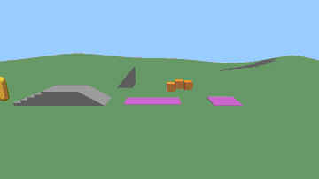
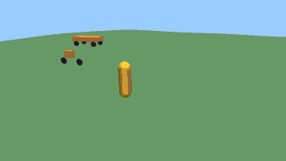
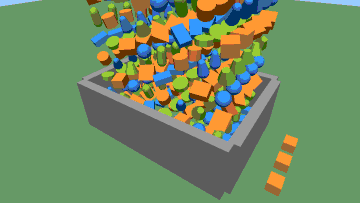
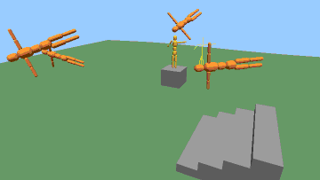
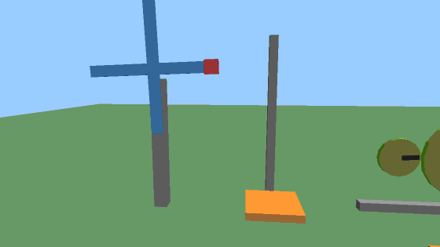
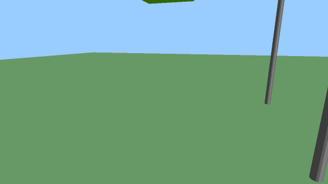
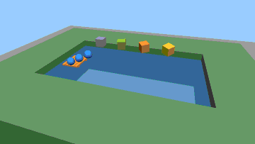
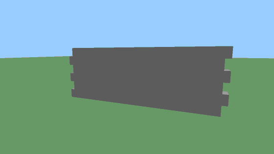
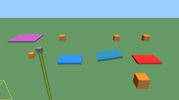
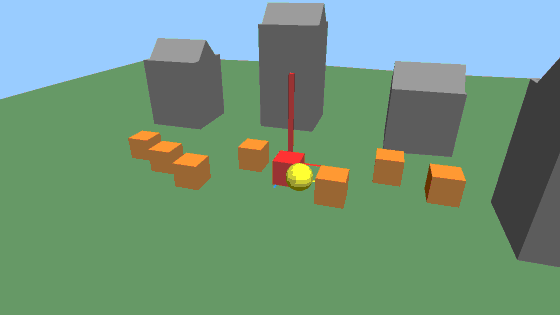

# Playground

`examples/playground` is a program with a window that shows what `oxijolt` does, in ten small
scenes. Each scene owns its own `PhysicsWorld`, built fresh when the scene is chosen or reset. The
same scenes run without a window, for tests and CI, and record the clips on this page.

## Running it

In a clone of the repository:

```sh
git clone --recursive https://github.com/pockerhead/oxijolt
cd oxijolt
cargo run -p playground --release
```

It needs Rust (stable), CMake 3.20 or newer and a C++ toolchain: MSVC on Windows, where the window
needs nothing else. On Linux, install `pkg-config libx11-dev libxi-dev libgl1-mesa-dev` first; CI
builds the window on Windows only. The first build compiles Jolt and takes several minutes.

To skip compiling Jolt on Windows, download
`oxijolt-sys-<version>-x86_64-pc-windows-msvc-debug-renderer.tar.gz` from the
[releases](https://github.com/pockerhead/oxijolt/releases), unpack it, and point `JOLTC_LIB_DIR` at
the unpacked directory in the shell that builds the playground (other builds refuse a prefix with
the debug renderer; it needs MSVC 19.44 or newer, see
[building](building.md#release-archives)):

```powershell
$env:JOLTC_LIB_DIR = "C:\path\to\oxijolt-sys-<version>-x86_64-pc-windows-msvc-debug-renderer"
cargo run -p playground --release
```

## Keys

These keys work in every scene:

| Keys | Action |
|---|---|
| 1 to 9, 0 | choose a scene |
| R | reset the scene |
| P | pause |
| N | one tick while paused |
| G | collider wireframe (with the `debug-renderer` feature) |
| H | hide or show the help panel |
| right drag, wheel | orbit and zoom the camera |
| Esc | quit |

The window runs the scenes at a fixed step of 60 Hz, at most four ticks per frame (a slower frame
drops the rest), and hands each key press to exactly one tick. Each scene below adds its own keys.

## Scenes

### 1 Character on terrain (`character`)



*The walker climbs the stairs and goes down the ramp, rides the conveyor and the ferry, steps off
and jumps.*

A humanoid walks a course on heightfield terrain: stairs of rounded boxes, a 30° ramp made of a
triangle mesh, a conveyor belt, a kinematic ferry, and jumps. A 50° slope and crates to push stand
beside it. It uses `CharacterSettings::humanoid`, `create_character`,
`refresh_character_contacts`, `update_character` with `ExtendedUpdateSettings`,
`CharacterContactListener::adjust_body_velocity`, `ground_velocity`, `move_kinematic`,
`Shape::new_height_field`, `new_mesh` and `new_convex_hull`.

| Keys | Action |
|---|---|
| W A S D | walk, relative to the camera |
| Shift | sprint |
| Space | jump |

### 2 Car, tank and motorcycle (`vehicles`)



*The walker, then the car driving off, shifting up and turning, the tank turning on the spot, and
the motorcycle from behind as it leans into a turn. The white spokes turn with the wheel poses the
binding reports.*

A car, a tank and a motorcycle on rolling terrain, and a walker; Tab switches which one the keys
drive. It uses `VehicleSettings::car`, `TrackedVehicleSettings`, `MotorcycleSettings::bike`,
`create_vehicle`, `create_tracked_vehicle`, `create_motorcycle`, `set_driver_input`,
`wheel_world_transform`, `current_gear`, `lean` and `Shape::new_offset_center_of_mass`.

| Keys | Action |
|---|---|
| Tab | switch: walker, car, tank, motorcycle |
| W S | throttle; against the motion it brakes first |
| A D | steer; the tank turns on the spot when standing |
| Space | hand brake, or jump when walking |

### 3 Body pile and impacts (`pile`)



*The whole drop of 400 bodies, impacts flashing red; then closer, two heavy balls, the crates beside
the bin asleep in grey, and one more layer.*

400 bodies of nine shape kinds fall into a bin; estimated impacts flash, sleeping bodies turn grey.
It uses boxes, spheres, capsules, cylinders, tapered shapes, convex hulls, `Shape::new_scaled`,
`MotionQuality::LinearCast`, `EventSettings::collision_estimates`, `ActivationEvent` and
`active_body_poses_into`.

| Keys | Action |
|---|---|
| Space | drop another layer |
| F | fire a heavy ball at the cursor |

### 4 Ragdolls and a mapped puppet (`ragdolls`)



*The puppet waves beside the animation skeleton it is mapped to, its joint limits drawn in purple
and each part's direction in red; it falls on its motors. Then a new ragdoll drops among the
settled ones, which turn grey.*

Humanoid ragdolls fall onto terrain and stairs until they settle; a puppet follows a wave of a
22-joint animation skeleton, kinematically or with its motors while it falls. The limit guides show
each joint's swing cone, hip pyramid or hinge arc in the parent part's frame; a part can pass them
for a moment on an impact. It uses `RagdollSettings`, `create_ragdoll`, `SettleDetector`,
`SkeletonMapper::map_reverse` and `map`, `drive_to_pose_using_kinematics`,
`drive_to_pose_using_motors`, `set_motion_type` and `set_pose`.

| Keys | Action |
|---|---|
| Space | drop another ragdoll |
| M | puppet: motors and falling, or back to kinematic |

### 5 Constraints and motors (`constraints`)



*The windmill speeding up and the elevator rising; the gears and the rack and pinion; the cart on its
path; the bridge, the rope and the pulley; the lamp, the pendulum and the swing on their limits.
The dark spokes and the red blade tip turn with their bodies.*

A windmill, an elevator, gears, a rack and pinion and a cart on a path, all motorized; a plank
bridge, a rope, a pulley and a weld; a lamp on a cone, a pendulum, a swing and a puck with locked
axes. It uses all twelve constraint kinds, `MotorState`, `set_target_angular_velocity`,
`set_target_position`, `set_target_velocity`, `HermitePath` and `AllowedDofs`.

| Keys | Action |
|---|---|
| Up, Down | windmill motor faster or slower |
| E | elevator up or down |

### 6 Cloth, balloon and soft cube (`soft-bodies`)



*The soft cube lands and gives way to a ball, the balloon squashes and takes a ball, and the cloth
that caught three boxes drops with them when its pins go.*

A cloth pinned on four poles catches boxes, a pressurised balloon squashes, a soft cube keeps its
volume. It uses `SoftBodySharedSettings` (generated and explicit constraints, volume constraints),
`SoftBodySettings::pressure`, `create_soft_body`, `vertices_into` and `set_vertex_inverse_mass`.

| Keys | Action |
|---|---|
| E | release the cloth's pins |
| F | throw a ball at the cursor |

### 7 Buoyancy and water (`water`)



*Low over the four crates, which sink, hover and float at different depths; then beside the raft as
the current carries it and the balls.*

Crates of buoyancy 0.5, 1, 2 and 4, a raft and balls in a pool; a current carries what floats. It
uses `BodyMut::apply_buoyancy_impulse`, `BuoyancySettings::fluid_velocity`, `Shape::new_compound`
and `Shape::new_plane`.

| Keys | Action |
|---|---|
| C | current on or off |
| Space | drop another crate |

### 8 Breakable wall (`destruction`)



*Two cannonballs knock holes in the wall, and a click knocks out one more brick.*

A wall of 48 bricks loses the bricks that cannonballs or clicks hit; each brick falls on as a body.
It uses `MutableCompound`, `to_shape`, `BodyMut::set_shape`, `compound_sub_shape`,
`CollisionEstimate` and `cast_ray` with `compound_child`.

| Keys | Action |
|---|---|
| F | fire a cannonball at the cursor |
| left click | knock out the brick under the cursor |

### 9 Contact control and sensors (`contacts`)



*A box shot up through the one-way platform lands on top of it; the chain swings and boxes land on
the material tiles; after a second drop a box enters the sensor (yellow box, the box inside turns
red), the conveyor carries one and another slides on the ice, and one bounces on the trampoline.*

A one-way platform, a conveyor, an ice slab and a trampoline made by a contact listener; a sensor;
a chain whose overlapping links do not collide; floor tiles that name their material. It uses
`ContactListener` (`contact_validate`, `contact_added`, `contact_persisted`), `ContactSettings`,
`BodySettings::sensor`, `GroupFilterTableBuilder`, `CollisionGroup`, `PhysicsMaterial` and
`ContactManifold::materials`.

| Keys | Action |
|---|---|
| Space | drop a box over every station |
| E | swing the chain |

### 0 Queries, state and origin (`queries`)



*The cursor sweeps the town: the yellow cross and normal mark the ray's hit, the yellow sphere where
the sphere cast stops, the hit body turns red. A clicked crate flies and turns kinematic (purple);
the red post at the world's origin jumps to the cursor when the origin moves. Last, the collider
wireframe.*

Under the cursor: a ray cast, a sphere cast, a sphere overlap and a point test in a small town;
pushing and toggling crates, saving and restoring, moving the origin, the collider wireframe. It uses
`cast_ray`, `cast_shape`, `collide_shape`, `collide_point`, `add_impulse_at_point`,
`set_motion_type`, `save_state`, `restore_state`, `rebase` and `debug_lines`.

| Keys | Action |
|---|---|
| mouse | ray, sphere cast, overlap and point test under the cursor |
| left click | push the body under the cursor |
| T | the last clicked crate: kinematic or dynamic |
| K, L | save the world, restore it |
| B | move the origin to the point under the cursor |

What is not shown, because it has nothing to draw: Jolt's jobs on a caller's thread pool, `f64`
positions, the `glam` and `mint` conversions, the prelude and the error type.

## Without a window

```sh
cargo run -p playground --no-default-features -- --headless --scene all --threads 4
```

runs each scene's script for 780 ticks, longer than every clip, and prints one line per scene with
the bodies at the end and a digest of everything the scene simulated and drew; `--frames N` runs
another number of ticks. The digest folds typed values after every tick: every body of the world
in id order (motion type, whether it is active, position, rotation, velocities, and each soft body
vertex's position, velocity and inverse mass), the scene's own state (characters, vehicles' wheels
and drivetrain, ragdoll poses, its script's counters) and what it drew. CI runs every scene with 1
and with 4 worker threads and checks that the lines match, and
`cargo test -p playground --no-default-features` checks the same in one process, along with resets,
pose syncing, the draw-call limits and the GIF encoder. A run as long as a scene's clip fails when
the scene misses one of its milestones, the things its clip must show.

## Recording the clips

```sh
cargo run -p playground --release -- --record all
```

writes `docs/media/<scene>.gif` for every scene; `--record <scene>` records one, `--out <dir>`
writes elsewhere. A recording runs the scene's script at the fixed step and renders every second
tick from the scene's record camera, which cuts between close shots and follows what the script
drives, into a 1120 x 630 render target, with lines drawn 3 pixels wide. Each frame is read back,
halved to 560 x 315, mapped through a fixed palette of 256 colours (a 6 x 6 x 6 colour cube and
greys) and stored as only the rectangle that changed since the last frame, at 30 frames per second.
Recording fails when the clip misses a milestone, when a GIF passes 1.5 MB, or when all of them
together pass 12 MB. The simulation is deterministic, but the GPU's rendering is not promised to
give the same pixels on another machine.

## How the scenes draw

Nothing in `oxijolt` knows about drawing. A scene reports what the binding gives it: the poses of
its bodies (synced after each step from `active_body_poses_into` and the bodies that fell asleep),
wheel poses from `wheel_world_transform`, soft body vertices, the character's position and up, and
debug lines. Markers that show turning (spokes on wheels and gears, a blade tip) and the ragdoll's
limit guides are posed from those same readouts. The binding has no shape introspection, so the
playground keeps its own description of each shape it creates next to the `Shape`, and turns it
into a flat-shaded triangle mesh once. Each frame those meshes are posed and shaded on the CPU and
sent to the GPU in draw calls of at most 19 999 triangles, below the 60 000 vertices per draw call
the window configures.

## Features

| Feature | Default | Effect |
|---|---|---|
| `window` | on | the window and the recorder ([macroquad](https://crates.io/crates/macroquad)); without it only `--headless` runs |
| `debug-renderer` | on | `oxijolt/debug-renderer`: the collider wireframe |
| `asserts` | off | `oxijolt/asserts`: Jolt's debug assertions; a failed one aborts |
